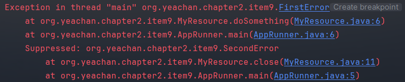

# try-finally 보다는 try-with-resources를 사용하라

기존의 닫는 자원들의 관리는 생각보다 많이 귀찮고 복잡했다.

```java
MyResource myResource=new MyResource();
        try {
            myResource.doSomething();
            MyResource secondResource=null;
            try{
                secondResource=new MyResource();
                secondResource.doSomething();
            }finally {
                if(secondResource!=null)
                    secondResource.close();
            }
        }finally {
            myResource.close();
        }
```

리소스를 생성하고 해제할 때 마다 try-finally로 close를 직접 실행했어야 했다.

이렇게되면 코드도 장황해지기도 하지만 가장 큰 문제는 예외처리가 구체적이지 않다.

위의 코드를 보면 `myResource.doSomething();`에서 에러가 발생하고 `myResource.close();`에서 에러가 발생하면 두번째 에러만 확인 가능하다.

```java
try(MyResource myResource=new MyResource()) {
            myResource.doSomething();
        }
```



try-with-resource를 사용해 디버깅의 이점을 가져갈 수 있다.


```java
try(MyResource myResource=new MyResource();
            MyResource myResource1=new MyResource();) {
            myResource.doSomething();
            myResource1.doSomething();
        }
```

리소스가 여러개인 경우 이런식으로 여러개 만들어도 된다.
